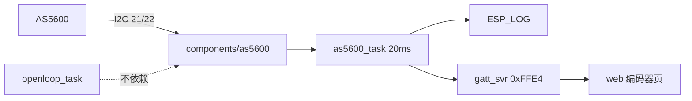

# AS5600 独立传感器接通

开环换相保持现状（`components/bldc/bldc.c` 不改）。AS5600 按 BMI088 的方式做成独立组件：自己读、自己打日志、自己推 BLE。

## 硬件

- I2C **不是** 21/22 死脚。经典 ESP32 走 GPIO 矩阵，SDA/SCL 可映射到多数 GPIO。21/22 只是常见默认，且当前工程空着，作为本次约定。
- 组件里用宏定义引脚（`AS5600_PIN_SDA=21`、`AS5600_PIN_SCL=22`），以后要换脚只改这两处。
- 地址 `0x36`，400 kHz
- I2C 上拉：模块已带 **10k**，短杜邦线先**不再外加**。10k 在 400 kHz 略偏弱（电容大时上升沿可能超 300 ns）。
  - 通信稳定：就用板上 10k
  - 偶发 NACK / 读数跳：再并 4.7k（并联约 3.2k），或把总线降到 100 kHz
  - 上拉必须到 3.3V，不要拉到 5V
  - ESP32 内部上拉约 45k，和 10k 并联约 8k，帮助有限，不替代板上电阻
- 电机 PWM 线与 I2C 分开走，共地
- 避开已占用：舵机 18，BMI088 SPI 14/13/27/15/4，无刷 25/26/32/33；以及 strapping / flash 脚（0、2、6–11、12 等）

不写 CONF、不烧 OTP。零点标定留到下一步。

## 软件结构



### 组件 `components/as5600/`

对齐 `components/bmi088/`：

- `include/as5600.h` / `as5600.c`
- `CMakeLists.txt`：`PRIV_REQUIRES esp_driver_i2c`（IDF v6 `i2c_master`）

对外接口：

```c
typedef struct {
    uint16_t raw;       /* 0..4095, ANGLE 0x0E */
    float angle_deg;    /* 0..360 机械角 */
    float rpm;          /* unwrap 后差分 */
    bool magnet_ok;     /* STATUS MD */
    bool magnet_weak;   /* ML */
    bool magnet_strong; /* MH */
} as5600_sample_t;

esp_err_t as5600_init(void);
esp_err_t as5600_read(as5600_sample_t *out);
```

`as5600_init()`：装 I2C 总线 + 设备，读 `STATUS (0x0B)` 探活；NACK 则失败。

`as5600_read()`：读 `STATUS` + `ANGLE`；组件内 unwrap，用两次采样间隔算 rpm，过零不要跳 ±一圈。I2C 失败返回错误，调用方保留上一拍。

### 编排 `main/main.c`

仿 `imu_log_task`（现已注释）加 `as5600_task`：20 ms 读一次，`gatt_svr_notify_as5600()`，约 200 ms 打一条日志（角度、raw、rpm、磁铁状态）。

`as5600_init()` 失败只打日志，不阻断 BLE / BLDC。`main/CMakeLists.txt` 加上 `as5600`。

### BLE `main/gatt_svr.c`

Service `0xFFE0` 新增特征 **`0xFFE4`**（Read + Notify），与 IMU 并列，不塞进 `bldc_status_t`。

8 字节 LE：

- `u16 raw`
- `u16 deg_x10`（0–3599）
- `i16 rpm_x10`
- `u8 flags`：bit0 MD，bit1 ML，bit2 MH
- `u8 pad`

订阅 / 断线清理跟 IMU、BLDC 同一套。广播说明补一行 `0xFFE4`。

### 网页 `web/index.html`

新标签「编码器」：raw、机械角、实测 rpm、磁铁状态；用现有 canvas 风格画一个角度盘。连接时 `startNotifications(0xFFE4)`，断开时停掉。标题和 Service 说明补上 `0xFFE4`。

### 文档

- `README.md` 硬件表加 AS5600 21/22；BLE 说明加 `0xFFE4`

## 不做

- 不改开环 `s_theta` / 占空比
- 不做电气零点、传感器换相、电流环
- 不写 AS5600 OTP
